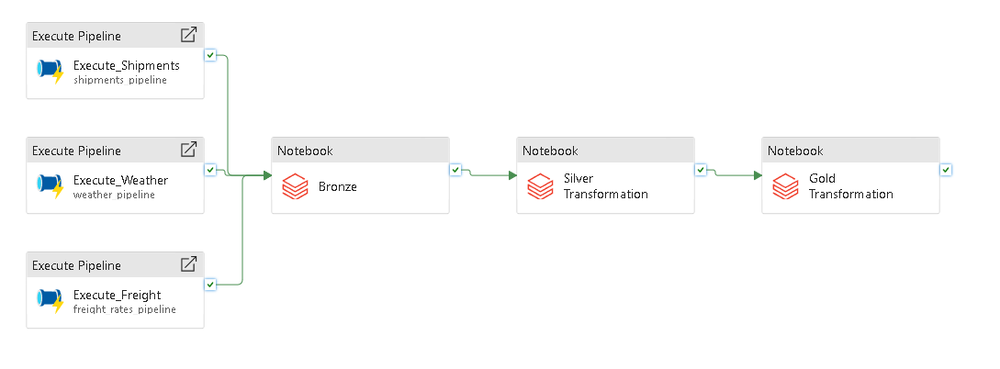
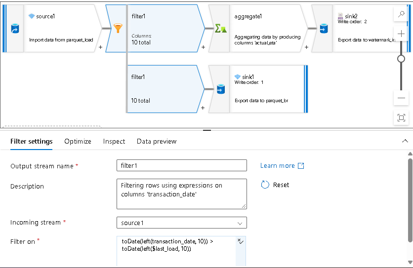
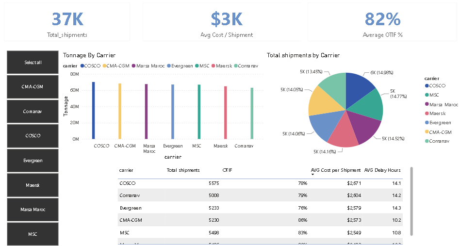

# Freight Data Engineering Platform

An end-to-end data engineering project for collecting, processing, and analyzing freight and maritime logistics data.

## Architecture



**APIs / Source Data → Azure Data Factory → ADLS Gen2 → Databricks / PySpark → Delta Lake → Power BI**

## What I Built

* API and file ingestion with **Azure Data Factory**
* Parameterized pipelines and **ForEach** processing
* Incremental data loading with **ADF Data Flow**
* Raw data storage in **ADLS Gen2**
* Data transformation with **Azure Databricks and PySpark**
* Bronze → Silver → Gold data organization
* Delta Lake tables for processed data
* Power BI data mart and dashboard

### Incremental Processing



### Dashboard



The processed data is prepared for logistics analysis and reporting in Power BI.

## Data Sources

* Shipment data
* Historical weather
* Port congestion
* Fuel prices
* Freight rates

## Tech Stack

**Azure Data Factory · ADLS Gen2 · Azure Databricks · PySpark · Delta Lake · Power BI · REST APIs · Python**

## Repository Structure

```text
assets/          # Architecture and dashboard images
data/            # Source/project data
dataflow/        # ADF data flows
dataset/         # ADF datasets
linkedService/   # ADF connections
notebooks/       # Databricks / PySpark notebooks
pipeline/        # ADF pipelines
```

## Author

**Hamza Moudden** — Data Engineer / Data Scientist

[LinkedIn](https://www.linkedin.com/in/hamza-moudden/)
